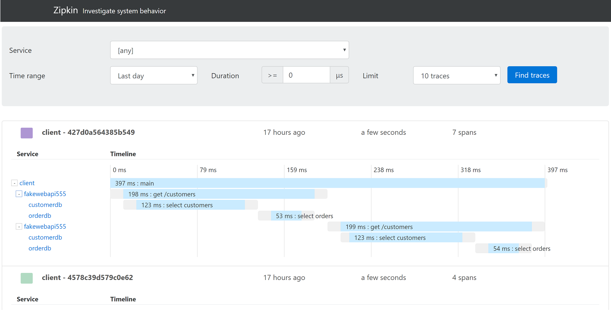

## zipkin-ui
> This project is generated with [yo angular2-typescript generator](https://github.com/shibbir/generator-angular2-typescript) version 0.6.2.



## Installation

```bash
$ npm install --dev
$ npm install typescript -g
$ npm start
```

This starts the UI listening on http://localhost:3000, targeted to a zipkin process listening on http://localhost:9411

If you aren't already running zipkin, you can start one like this:

```bash
$ wget -O zipkin.jar 'https://search.maven.org/remote_content?g=io.zipkin.java&a=zipkin-server&v=LATEST&c=exec'
$ java -jar zipkin.jar
```

## Production Build
```bash
$ npm run build
```

## Running Tests
```bash
$ npm test
```

## License
<a href="https://opensource.org/licenses/Apache-2.0">Apache-2.0 License</a>
